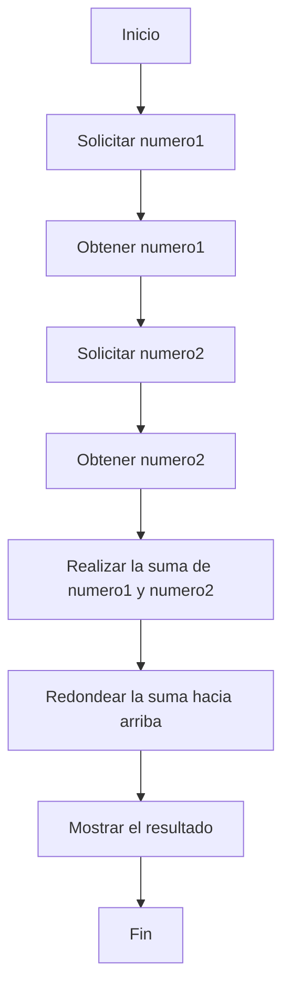

# Titulo del proyecto

Diagramas de flujo

## Descripción del proyecto

Realizar 3 ejercicios guiados, y elaborar diagrama de flujo para cada uno.

## Capturas de Pantalla del Proyecto

Incluir capturas de pantalla o imágenes que muestren el proyecto en funcionamiento.


Vista inicio de la aplicación.

## Prerrequisitos o Dependencias

Lista de software y herramientas, incluyendo versiones, que necesitas para instalar y ejecutar este proyecto:

- Sistema Operativo Window, Linux, MacOS
- Lenguaje de programación python

## Instalación del Proyecto

Una guía paso a paso sobre cómo configurar el entorno de desarrollo e instalar todas las dependencias.

```bash
# git clone github.com/KarenLimari/Diagramas_de_flujo
```

##Diagrama de flujo



## Instrucciones para Ejecutar el Proyecto

Instrucciones para ejecutar el proyecto una vez instalado.

```bash
#
```

## Autor

-Karen Limari [Karen Limari](github.com/KarenLimari)

## Licencia

Este proyecto está bajo la Licencia MIT - ve el archivo [LICENSE.md](LICENSE) para detalles
